# CS50 Psets: Web Programming

> Solutions implemented for `CS50x` from 2016 to 2018.

> For Problem Sets (Psets): `Pset 6 to Pset 8`.
  - [Pset6: Similarities](#pset6-similarities)
  - [Pset7: Finance](#pset7-finance)
  - [Pset8: Mashup](#pset8-mashup)

> For previous Psets: [Solutions for Pset 1 to Pset 5](https://github.com/JiwoonKim/CS50-Pset-General-Programming)

## :bulb: Pset6: Similarities
> Solved similarities(the more comfortable version) in June, 2018.

> A web application that depicts the costs of transforming one string into another by measuring the edit distance between two strings.

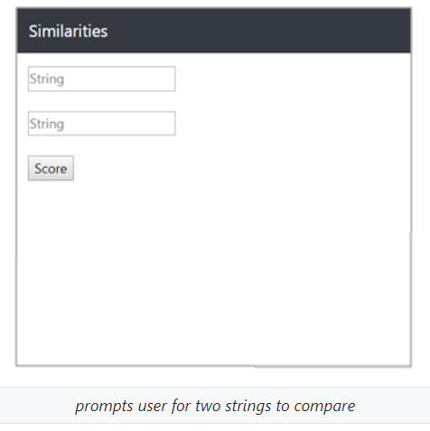 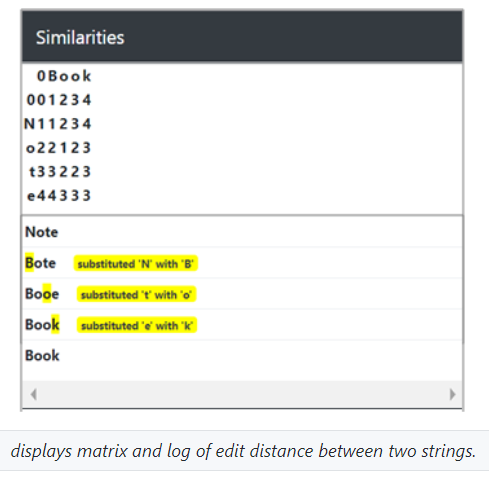

- `helpers.py`: function distances takes two strings as arguments and returns (via a matrix of costs) the edit distance between one and the other.
  > learned how to calculate __edit distance__ between two strings using __dynamic programming__.
  
- `index.html`: an HTML form via which a user can submit
- `matrix.html`: a page generating a visualization of the matrix returned by distances function (each cell contains a cost).
  > learned how to create a html form and use Jinja2 templating language.
  
  _disclaimer: only the function for calculating the edit distance and displaying the matrix of costs and the html form for two strings was implemented by myself (the web application's server (configuration for routes using flask framework) and various html files were implemented by CS50 not by myself)._

### What I learned from Pset6 :seedling:
> basic concepts of HTML, CSS, and a web server.

## :bulb: Pset7: Finance
> Solved Finance in July, 2018.

> A web app managing portfolios of stocks. Allows user to check real stocks' actual prices and portfolios' values, and let user simulate purchases and sales of stocks by querying IEX for stocks' prices. 

| /register | / |
:-------------------------:|:-------------------------:
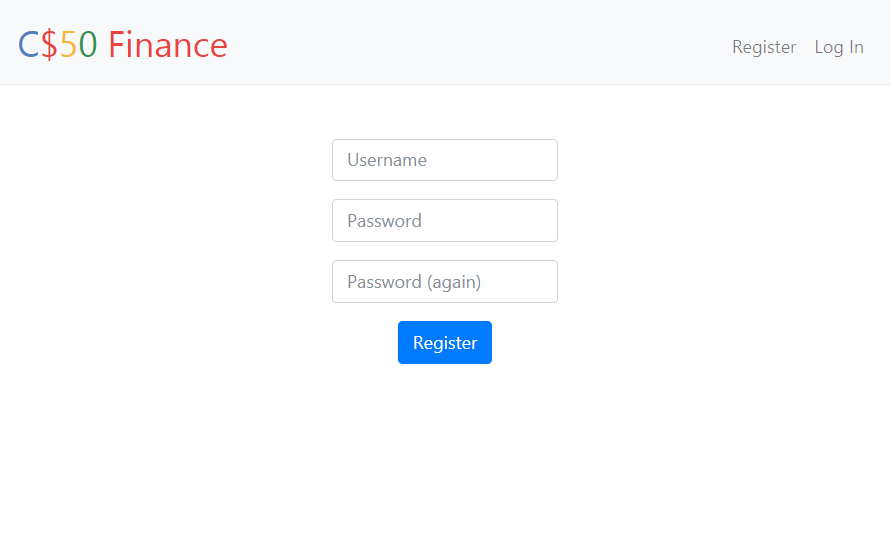 | 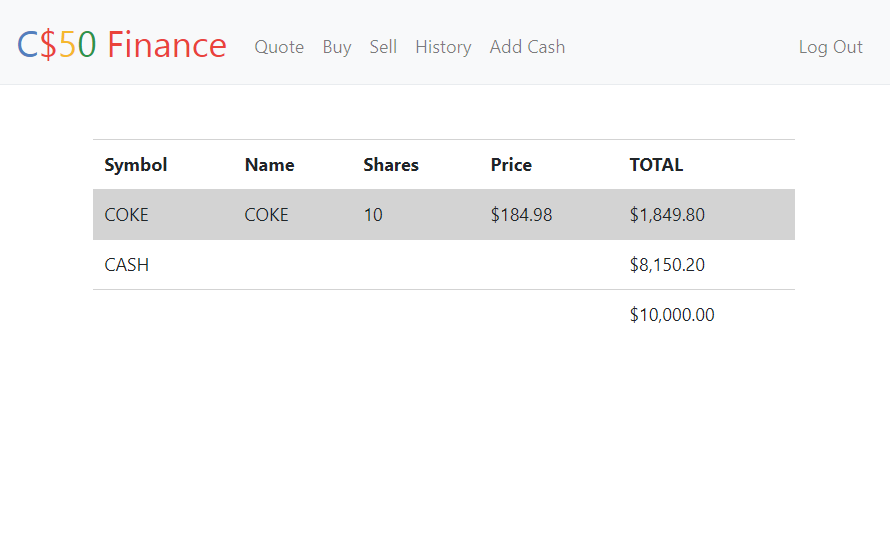
| _prompts user for inputs for registration_  | _displays user's portfolio and current cash balance_ |

| /quote (GET request) | /quote (POST request) |
:-------------------------:|:-------------------------:
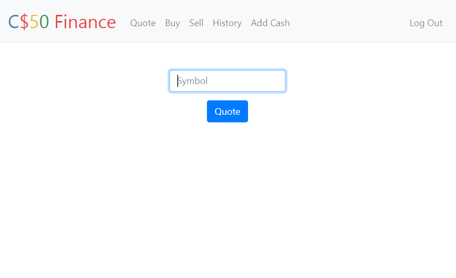 | 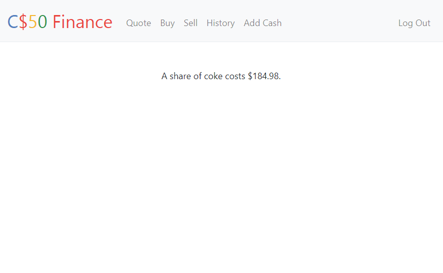
| _prompts user for stock's symbol to search_  | _displays the current price of the stock_ |

| /buy | /sell |
:-------------------------:|:-------------------------:
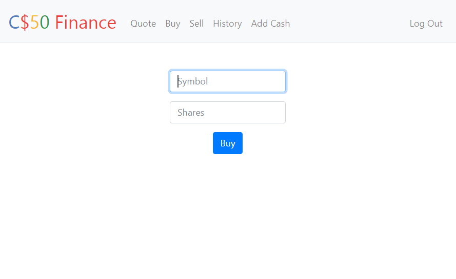 | 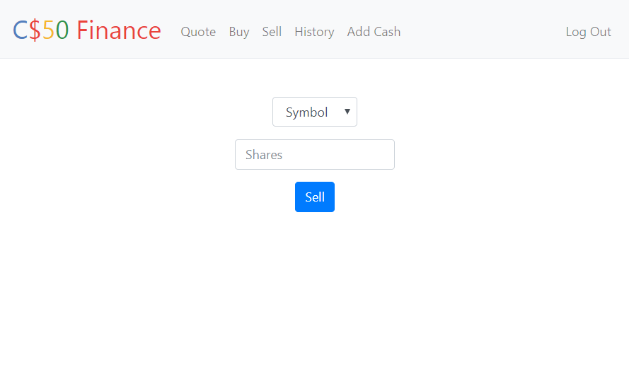
| _virtually buy stocks_  | _virtually sell stocks user owns_ |

| /history | /add_cash |
:-------------------------:|:-------------------------:
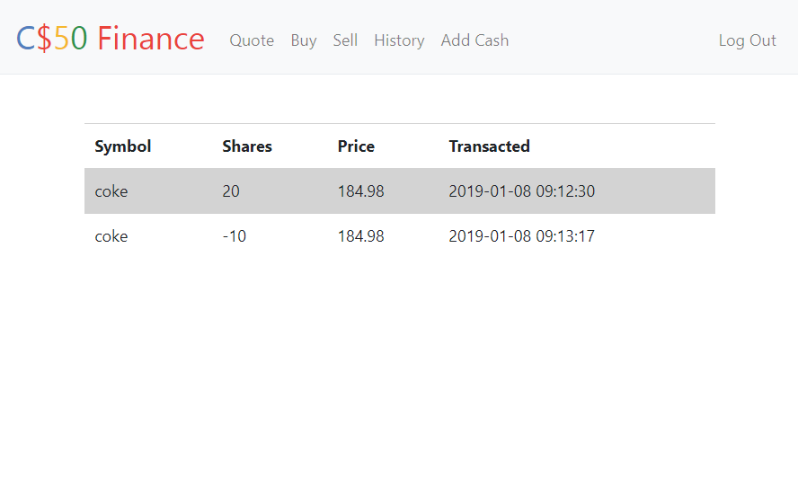 | 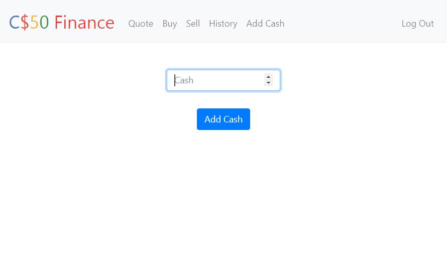
| _display all of user's transactions_  | _add more cash to user's account_ |

- `application.py`: a server program based on __Flask framework__, defines the following methods for routes.
  - `register`: enables user to register for an account by receiving a POST request from register.html and inserting the new user into the SQLite3 database.
  - `index`: displays a table summarizing the user's portfolio of which stocks the user owns and the user's current cash balance.
  - `quote`: enables user to look up a stock's current price by receiving both GET and POST requests. (GET request for displaying quote.html where user can input a stock's symbol and send a HTML form via POST request which then, renders quoted.html which displays the stock's current price.)
  - `buy`: enables user to simulate a purchase of stocks by receiving a POST request from buy.html and recording the purchase in the database.
  - `sell`: enables user to simulate a sale of stocks by receiving a POST request from sell.html and retreiving stocks user owns and recording the sale in the database.
  - `history`: displays a table summarizing all of the user's transactions made.
  - `add_cash`: a personal touch to the web appliction to enable the user to add more cash.
  
> learned how to configure the __logical flow of a server__ via methods for routes (URLs)

> learned how to __manipulate databases using SQL__ (i.e. create tables, insert and updata data, and search for data) in a web server.

- HTML files
  - `register.html`: an HTML form to prompt user to submit a form for registration (inputs of id, password, and confirmation).
  - `index.html`: an HTML to display a table summarizing the user's portfolio of which stocks the user owns and the user's current balance account.
  - `quote.html`: an HTML form to prompt user for a stock's symbol to look up the current price of a stock.
  - `quoted.html`: an HTML to display the stock's current price.
  - `buy.html`: an HTML form to prompt user to virtually buy stocks.
  - `sell.html`:an HTML form to prompt user to virtually sell stocks.
  - `history.html`: an HTML to display a table summarizing all of the user's transactions made.
  - `addcash.html`: an HTML form to add more cash to the user's balance account.
  
> learned HTML syntax, jinja2 templating language, how to create an HTML form.

  _disclaimer: helpers.py, login and logout methods within application.py, login.html, apology.html were implemented by CS50 and not myself)._

### What I learned from Pset7 :seedling:
> how a web application is structured using HTML, CSS, and a web server (Flask).

> the __MVC (Model-View-Controller) paradigm__. Particularly the model and controller.

> how a __web server framework__ (i.e. Flask) handles __requests__ and sends __responses__.

> how to manipulate data and databases using __SQL (Structured Query Language)__.
      
## :bulb: Pset8: Mashup
> Solved Mashup in July, 2018.

> A web application where users can search for Google News articles atop a map interface from Google Maps.

> Used open application programming interfaces (APIs) and Javascript Libraries.

| / | / (clicked on marker) |
:-------------------------:|:-------------------------:
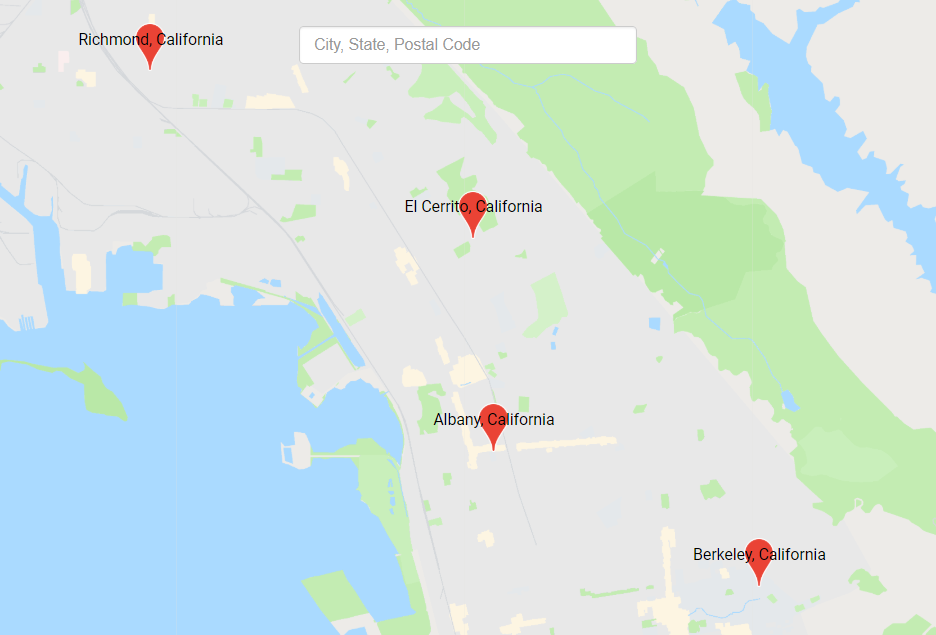 | 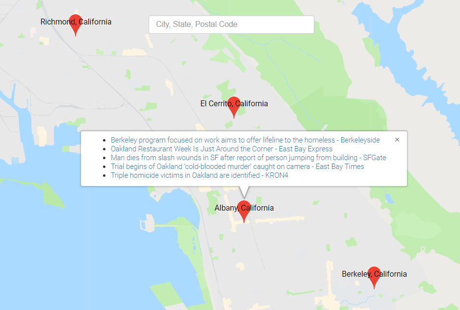
| _displays markers for cities on map_  | _displays popup of articles for clicked city_ |

| /articles?geo=02138 | /search?q=New+Haven |
:-------------------------:|:-------------------------:
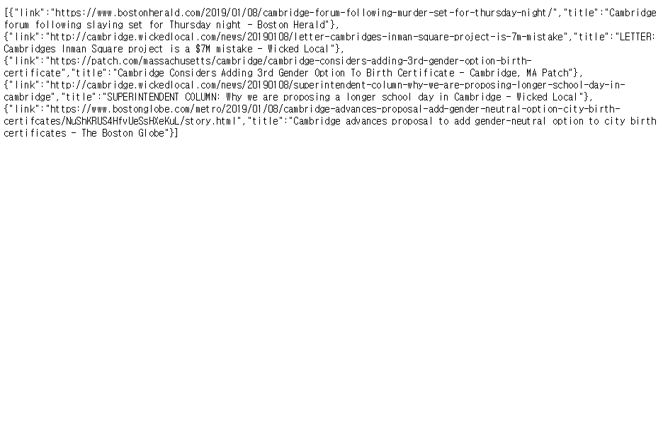 | 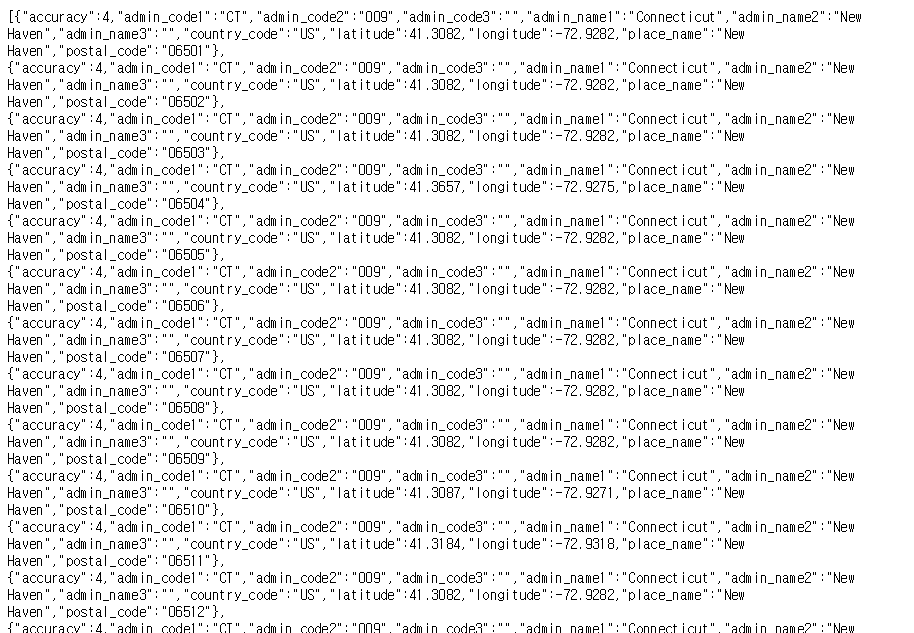
| _outputs JSON of articles for given postal cord_  | _outputs place data according to search query_ |

- `scripts.js`: the front-end UI for the web application, defines the following functions for.
  - `configure`: 
  - `addMarker`: 
  - `removeMarkers`:
  
  > learned 

- `application.py`: the back-end server program based on __Flask framework__, defines the following methods for routes.
  - `articles`: outputs a JSON array of objects for articles based on the geo location (GET parameter)
  - `search`: outputs a JSON array of objects for places in the US matching the q (GET parameter for city, state, or postal code)

    > learned how to query and search for data (in various scenarios) using SQL using OR, AND, and wildcard(%).
    
    > learned how to implement my own API for the web application: returning JSON for articles based on geo location.

- `mashup.db`: database for web application.
  - created a table for places.
  
  > learned how to create a table for a database and import a .txt file to the table.

  _disclaimer: helpers.py, the index and update methods in application.py, index.html, style.css,  were implemented by CS50 and not myself)._

### What I learned from Pset8 :seedling:
> how to use an API (i.e. Google Maps Javascript API), RSS feeds from Google News

> Ajax, JSON, jQuery, Twitter's Typehead.js library

> HTTP requests and responses
